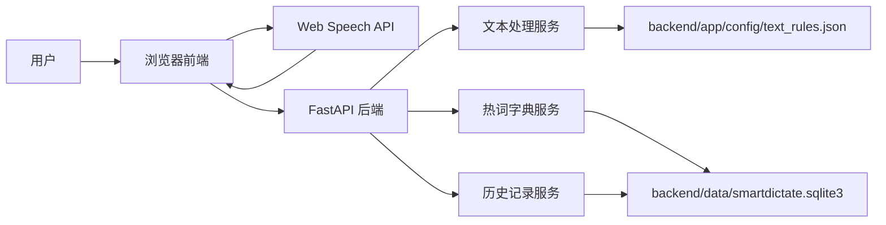

# 系统架构说明

SmartDictate 采用前后端分离、本地优先的架构。前端负责语音输入、编辑和交互，后端负责文本整理、热词纠错、历史记录和本地数据管理。

## 架构图



## 前端分层

```text
frontend/src/main.js
```

负责页面状态、事件绑定和 UI 渲染。

```text
frontend/src/modules/api-client.js
```

封装后端接口请求，避免业务逻辑里散落 `fetch` 调用。

```text
frontend/src/modules/speech-recognition.js
```

封装浏览器 Web Speech API，隔离语音识别的兼容性和错误处理。

```text
frontend/src/modules/html.js
```

封装 HTML 转义，避免历史记录和热词渲染时出现注入风险。

## 后端分层

```text
backend/app/main.py
```

FastAPI 应用入口，负责注册接口和依赖服务。

```text
backend/app/models.py
```

集中定义请求和响应模型，保证接口结构清晰。

```text
backend/app/services/text_processor.py
```

负责文本整理流程，包括口癖词清理、热词替换、标点整理和场景格式化。

```text
backend/app/services/hotwords.py
```

负责内置热词和用户自定义热词的合并、添加和删除。

```text
backend/app/services/transcript_store.py
```

负责历史记录的本地读写、删除和清空。

## 数据文件

```text
backend/app/config/text_rules.json
```

项目内置规则，随代码提交。

```text
backend/data/smartdictate.sqlite3
```

本地运行数据库，已被 `.gitignore` 忽略，不提交仓库。历史记录和用户自定义热词都保存在 SQLite 中。

## 中间件与可观测性

```text
backend/app/core/middleware.py
```

为每个请求添加 `X-Request-ID` 和 `X-Process-Time-Ms` 响应头，并输出基础访问日志。这样可以在前后端联调时快速定位一次请求，也能在路演中说明项目对接口耗时和问题排查的考虑。

## 为什么这样设计

- 本地优先：不依赖个人服务器，评委可以直接本地复现。
- 职责清晰：语音识别、文本整理、热词、历史记录分别独立。
- 便于扩展：后续可以把 Web Speech API 替换或扩展为在线语音识别 API。
- 便于测试：后端核心逻辑有单元测试覆盖。
